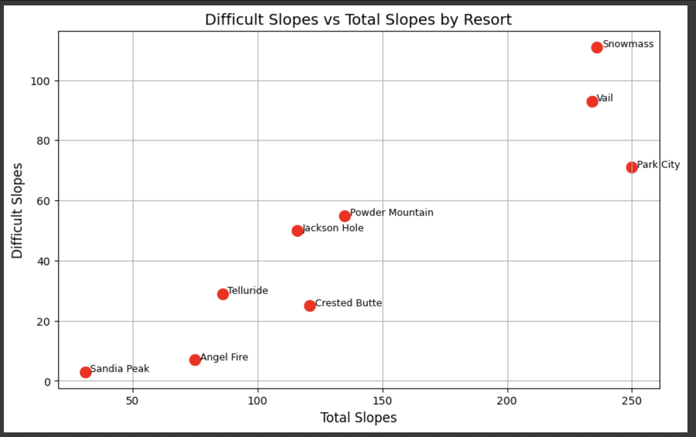
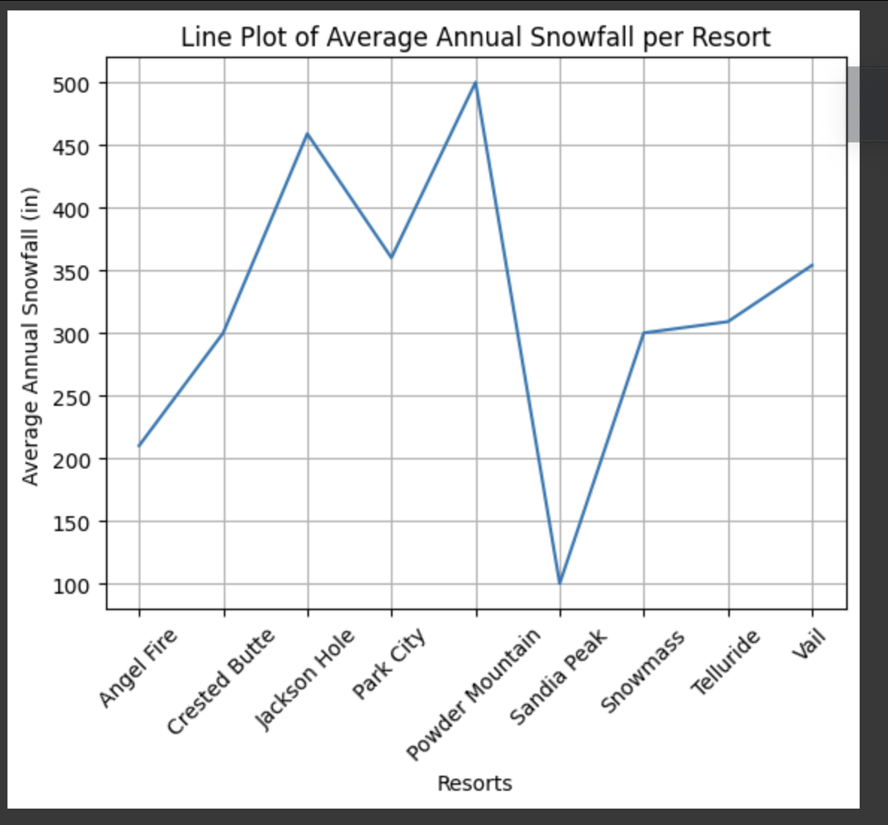
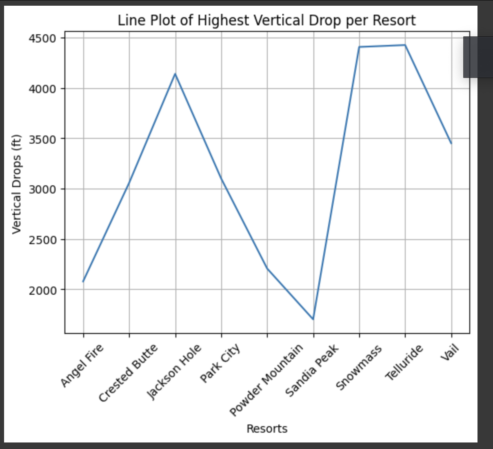
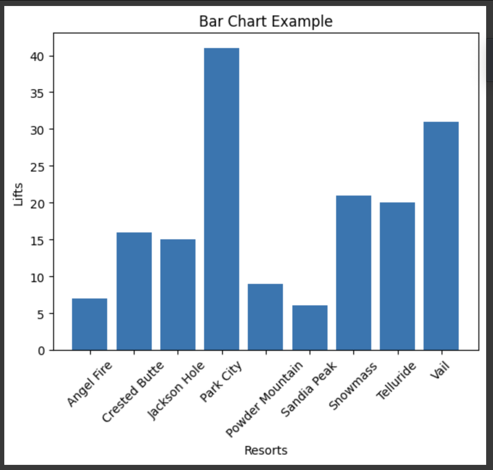
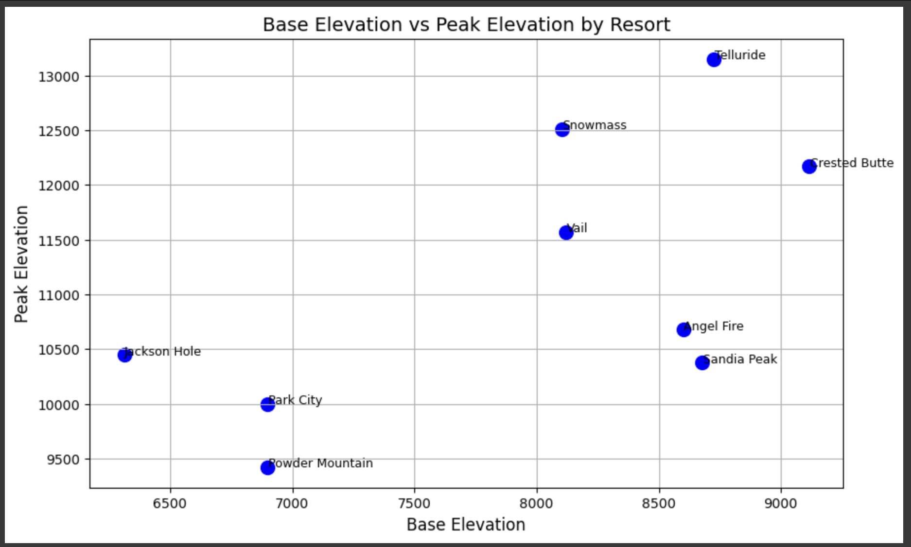

# Winter Vacation Route Optimization

This project was created for **Triple Ten's December Code Jam**.

---

### **Tech Used**

- HTML
- CSS
- Javascript

---

### **Process**

The software engineers had created a design using Figma , which was then converted into a responsive HTML/CSS layout.
We had used "Swiper" and "Leaflet" Javascript libraries to create a map and a slider. The Data engineering team
had gathered data from ski resorts across the US which allowed us to create a database of ski resorts with their respective locations and amenities.

---

### **Team Members**

- Bridget Due (Data Engineer)
- Michael Fulciniti (Data Engineer)
- Alex Johnson (Software Engineer)
- Ana Maria Martinez (Software Engineer)
- Martin Young (Software Engineer)

---

**Deployed at:**  
[Winter Vacation](https://typiql.github.io/WinterVacation/)

**Data Science Process**

**Dataset**

We utilized two datasets from Kaggle with ski resort data. We merged the datasets and dropped some unnecessary columns. Our final, merged dataframe consisted of the following columns:

- ‘Resort’ — unique resort name
- 'City' — the city the resort is located in
- 'State' — the state the resort is in
- ‘Longitude’ — longitude of resort
- ‘Latitude’ — latitude of resort
- ‘Difficult_slopes’ — number of hardest difficulty level slopes at the resort
- ‘Total_slopes’ — Total number of slopes at the resort
- ‘Nightskiing’ — Boolean column indicating if ski resort has night skiing or not
- 'Peak_elevation' - the peak elevation in feet
- 'Base_elevation' — the base elevation in feet
- 'Vertical_drop' — the vertical drop in feet
- 'Total lifts' — number of lifts available
- 'Avg_annual_snowfall' — annual snowfall received in inches

**Preprocessing**

We searched for good quality datasets with minimal preprocessing needed so both datasets were not missing any values but we did perform the following preprocessing:

1. Renaming columns
2. Duplicate column in datasets; dropping one
3. Drop unnecessary columns
4. Rename resorts to merge dataframes
5. Filtering down to just the resorts needed
6. Merged dataframes

**Random Model:**

First method:
— Used scikit shuffle and OSMnx library. We were able to run the code successfully with no errors but upon reviewing the data, determined it was incorrect

Second method:
— Built a custom function using haversine formula and used .sample. This was accurate and we used this

**Optimized model:**
— Built a custom function using nearest neighbor

**Exploratory Data Analysis**

**Project Notebook**
[Link to Notebook](2024_code_jam_winter_vacation.ipynb)
